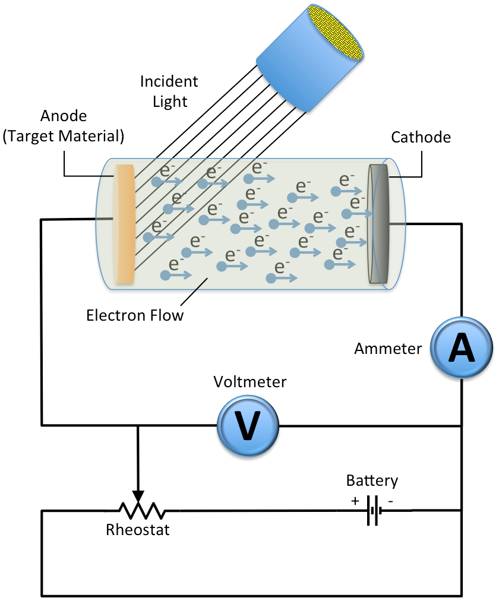
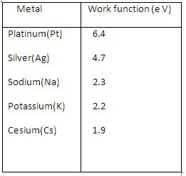
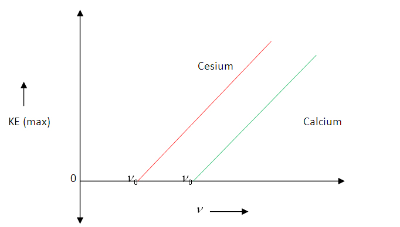
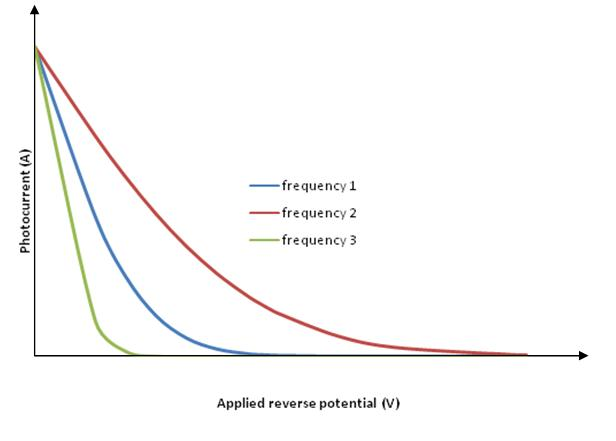
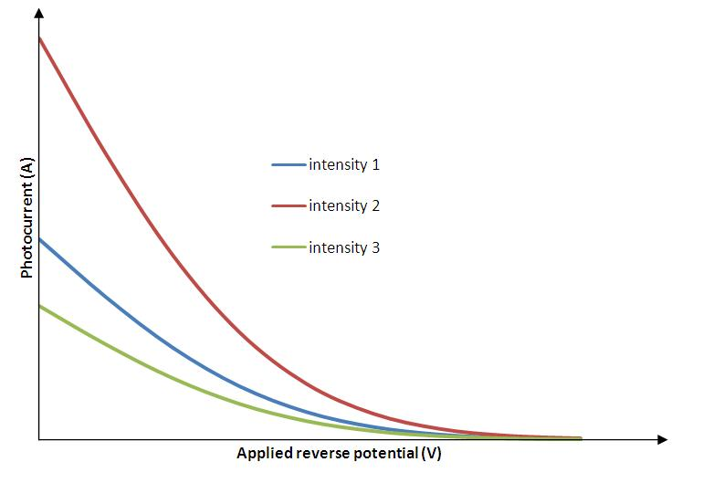

## Theory

During his experiments on electromagnetic radiation (to demonstrate light consists of e-m waves), Hertz noticed a spark between the two metallic balls when a high frequency radiation incident on it. This is called photoelectric effect. Photoelectric effect is the emission of electrons when electromagnetic radiations having sufficient frequency incident on certain metal surfaces. We call the emitted electrons as photoelectrons and the current they constitute as photocurrent. The phenomenon was first observed by Heinrich Hertz in 1880 and explained by Albert Einstein in 1905 using Max Planck's quantum theory of light. As the first experiment which demonstrated the quantum theory of energy levels, photoelectric effect experiment is of great historical importance.

 

### The important observations on Photoelectric effect which demand quantum theory for its explanation are:

<ol>
    <li>The Photoelectric effect is an instantaneous phenomenon. There is no time&nbsp;delay between the incidence of light and emission of photoelectrons.</li>
    <li>The number of photoelectrons emitted is proportional to the intensity of incident light. Also, the energy of emitted photoelectrons is&nbsp;independent of the intensity of incident light.</li>
    <li>The energy of emitted photoelectrons is directly proportional to the frequency of incident light.</li>
</ol>

 The basic experimental set up which explains Photoelectric effect is as given below,

 

  

 

It has been observed that there must be a minimum energy needed for electrons to

escape from a particular metal surface and is called work function 'W' for that

metal. The work function can be expressed in terms of frequency as,

$$W = h \nu_0 .............(1)$$

Where h is the Planck's constant and and $\nu_0$  is the threshold frequency (minimum frequency for photoelectric effect).The work function for some metals are listed in the table.   

 According to Einstein the Photoelectric effect should obey the equation,

 $$h\nu=KE_{max}+W............(2)$$

 From the above expression,

$$KE_{max}=h\nu-h\nu_0$$

$$KE_{max}=h(\nu-\nu_0)..........(3)$$

Which says the graph connecting the maximum kinetic energy of photoelectrons $KE_{max}$ and frequency of incident radiation, $\nu$ will be a straight line with slope and Y-intercept, $h\nu_0$ = workfunction. 
 
### Graph connecting $KE_{max}$ and frequency:

Maximum kinetic energy of photoelectrons versus frequency of incident radiation graph

Now, if we increase the reverse potential, the photocurrent gradually decreases and becomes zero at a particular reverse potential. This minimum applied reverse potential is called stopping potential $V_0$. Hence the maximum kinetic energy of photoelectrons can be written as,

$$KE_{max}=eV_0...........(4)$$

### Graph connecting photocurrent and applied reverse potential
#### For constant intensity and different frequencies

#### For constant frequency and different intensities

